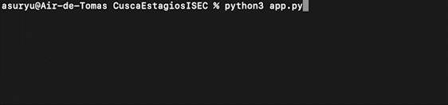

<h1 align="center">
  </a>
</h1>
<h4 align="center">A CLI tool to sneak peek internship proposals from ISEC</h4>

<p align="center">
  <a href="https://www.python.org/downloads/">
    
  </a>

</p>

<p align="center">
  <a href="#key-features">Key Features</a> •
  <a href="#download">Download</a> •
  <a href="#how-to-use">How To Use</a> •
  <a href="#example">Example</a>
</p>

<div align="center">
    
</div>

## Key Features

* See what internship proposals the students are choosing using Moodle filters
* Save the results in a JSON file that's easy to interpret
* Simple CLI that requires almost zero effort to use

> **UPCOMMING**: feature to list students that have chosen a certain proposal

## Download
To run this application you will only need to have [Python](https://www.python.org/downloads/) 3.0.0 or higher installed on your computer.
<br>
Download **cusca_turmas.py** from the releases page and you are good to go, just run `python cusca_turmas.py` and the classes are all yours!

```bash
# Clone this repository
$ git clone https://github.com/Asuryu/CuscaTurmasISEC

# Go into the repository
$ cd CuscaTurmasISEC

# Install dependencies 
$ pip install -r requirements.txt

# Run the script
$ python cusca_turmas.py
```

## How To Use
After launching the script, you will be asked to login in Moodle using your credentials and then it will show you what proposals are being scanned at the moment.<br>
When the script finishes searching all the proposals in the selected interval, the application will save all the collected information on a JSON file named **data.json**.

## Example
An example of what the output should look like when searching proposal 1 through 5 (1-5):
```json
{
  "P001": [],
  "P002": [
    { 
        "name": "Manel Tinoco", 
        "number": "2040103953"
    }
  ],
  "P003": [],
  "P004": [],
  "P005": [
    {
        "name": "Ana Cacho",
        "number": "2039102034"
    },
    { 
        "name": "Jacinto Leite", 
        "number": "2039210421"
    }
  ]
}
```
`The data will include all the students that selected each of the proposals.`
